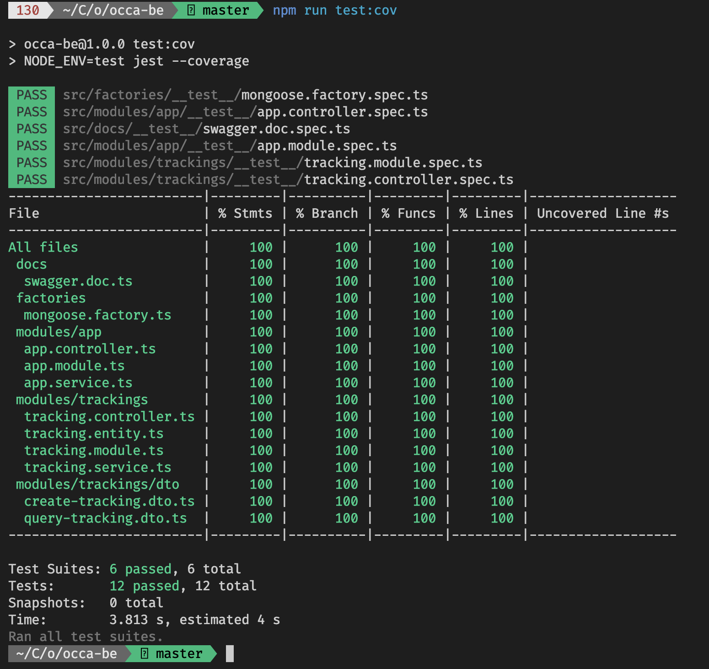
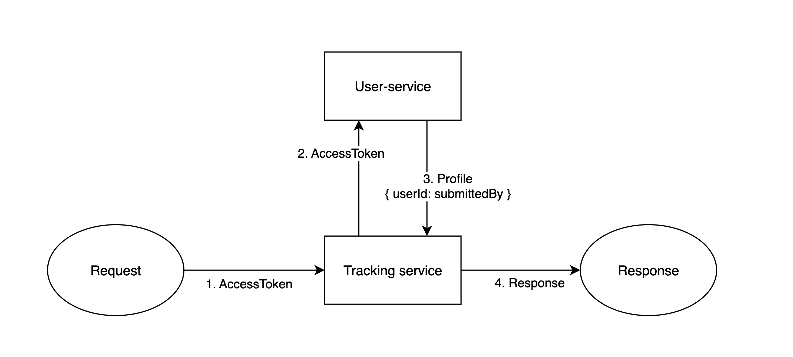
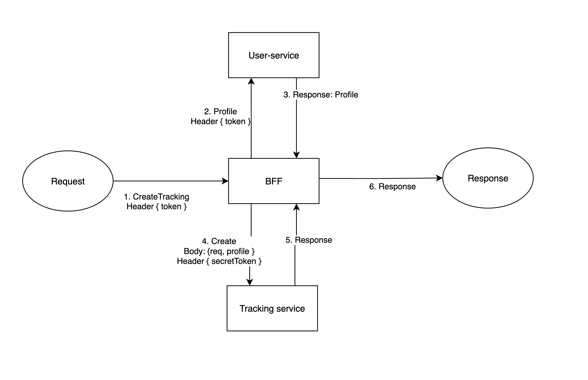

# Occa BE

## Getting Started

First, install dependencies by:

```bash
yarn install --frozen-lockfile
```

Then run in local server by:

```bash
yarn start:dev
```

The api endpoint will be run at: [http://localhost:3030/api](http://localhost:3030/api).

## API end points

| Feature         | Method   | Endpoint               | Documentation (Swagger) |
|-----------------|----------|------------------------|-------------------------|
| API docs    | `GET`    | `{root}/api/docs`              | [SwaggerDoc](http://localhost:3030/api/docs)
| Health Check    | `GET`    | `{root}api/`              | [Api health-check](http://localhost:3030/api/docs#/health-check/health)
| Get Tracking    | `GET`    | `{root}/tracking/:id` | [Api Get](http://localhost:3030/api/docs#/default/TrackingController_detail) |
| List Tracking   | `GET`    | `{root}/tracking`     | [Api List](http://localhost:3030/api/docs#/default/TrackingController_list) |
| Create Tracking | `POST`   | `{root}/tracking`     | [Api Create](http://localhost:3030/api/docs#/default/TrackingController_create) |
| Get Image | `GET`  | `{root}/tracking/:id` | [Api Get Image](http://localhost:3030/api/docs#/default/TrackingController_sendFile) |

## Swagger API documentation

This project integrates [Swagger-UI](https://swagger.io/tools/swagger-ui/) for documentation purpose and also allows user to test the application endpoint directly via browser.
After launch the project in local, you can access to the api-documentation link via: [http://localhost:3030/api/docs](http://localhost:3030/api/docs).

Swagger doesn't allow you to send file via swagger-express-ui. So here is the curl that allow you to create tracking record with image type (only *image/** mimetype is allowed):

```bash
curl --location 'http://localhost:3030/api/tracking' \
--header 'Content-Type: multipart/form-data' \
--form 'file=@"/Users/huuquannguyen/Downloads/325885872_705725441148181_4676774506102890551_n.jpg"' \
--form 'level="2"' \
--form 'submittedBy="quannh"'
```

Replace the first field: `--form 'file=your_file'` to create new tracking record.
The files will be saved to `**root**/public/` and you can get it via API get image:


## Testing

The project use [jest](https://jestjs.io/) for testing purpose for unit-test and integration-test.
In order to run set of tests, run:

```bash
yarn test
```

Or, you can check the coverage of those test cases by:

```bash
yarn test:cov
```

The coverage of this application is already at 100% for all column, including `%Stmts`, `%Branch`, `%Func%` and `%Lines`


## Others

The project also integrates [eslint](https://eslint.org/), [prettier](https://prettier.io/) for linting purpose; integrates [commitlint](https://commitlint.js.org/#/) for clarify commit message before push to repo; last but not least, integrates [husky](https://www.npmjs.com/package/husky) commit-hooks for every commit to the repo, help running the set of test-cases or running the linting command.

## Note

At first attempt, this app is designed to be `tracking-service` (microservices) and would have `user-service` for authentication and authorization.
User-service will public endpoints:

- login: get accessToken.
- register: register username, password. Also return few random words as string for password recovery using supporting libs (ex: [random-word npm](https://www.npmjs.com/package/random-words))
- password-recovery: verify by given phrase and return new accessToken with saved password.
- profile: return user's profile.

To verify request sent to tracking-service, we will forward the token to user-service to be verified and get user's profile:


2nd approach is using `gateway-service` (or backend-for-frontend (bff) design pattern) , proxy request to `user-service` or `tracking-service`, to simplify request structure.

